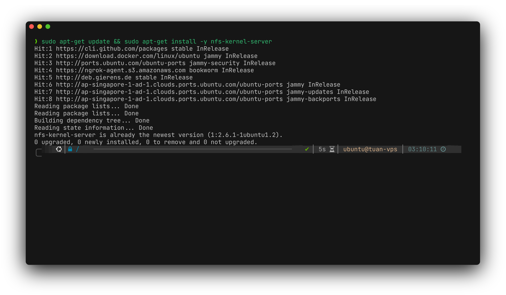
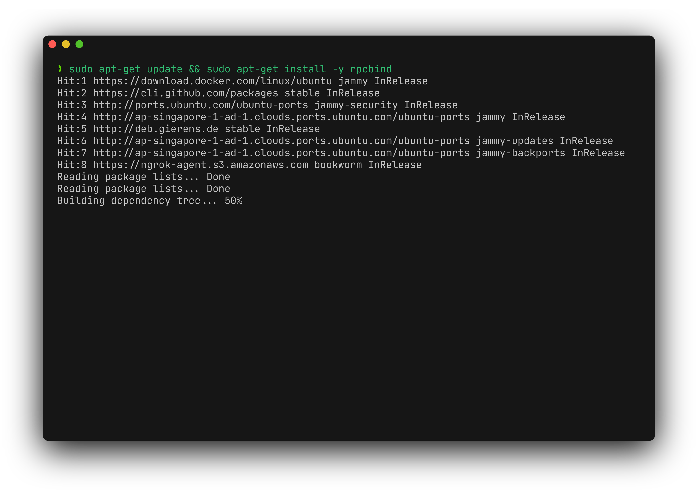
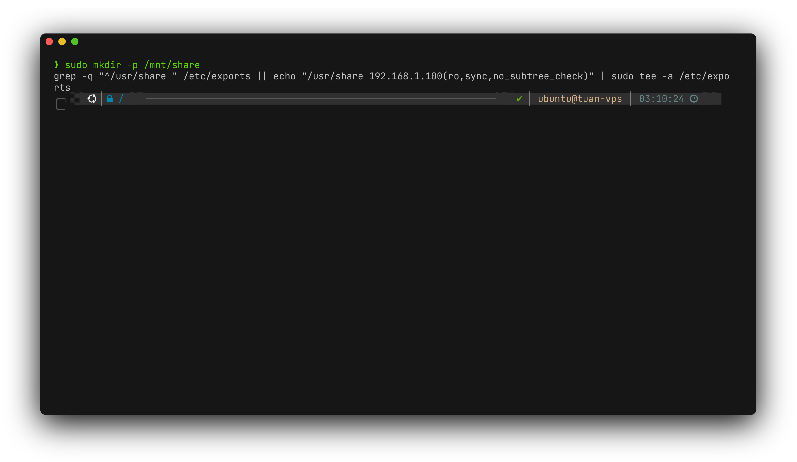
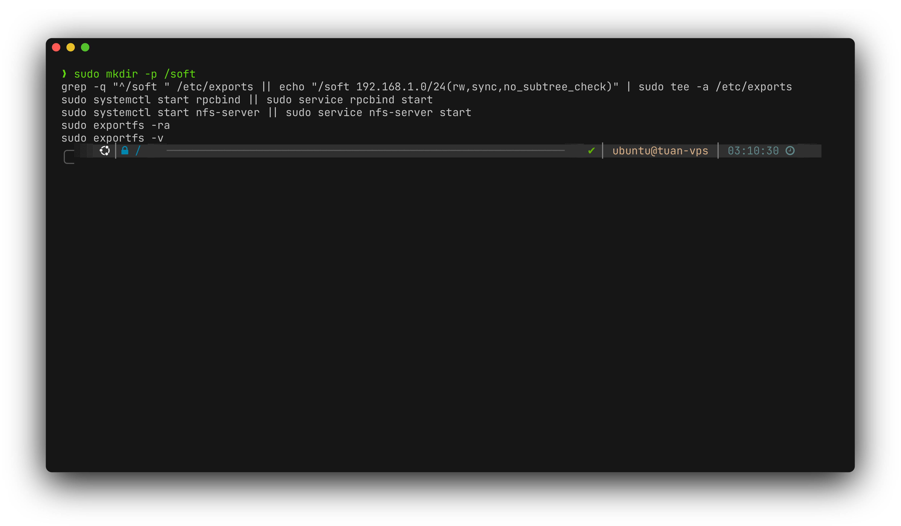
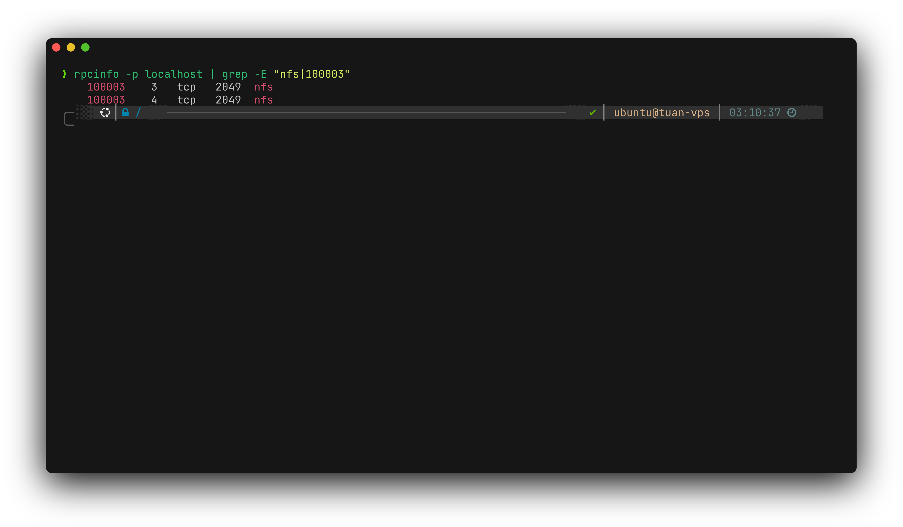
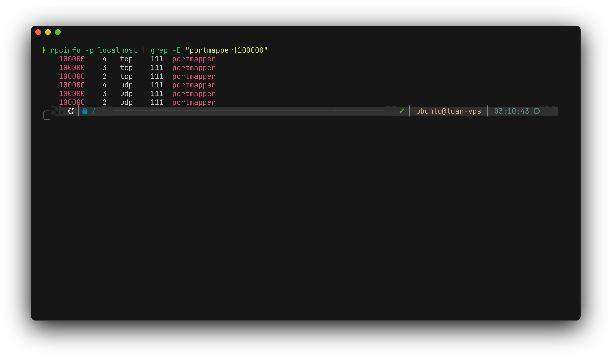
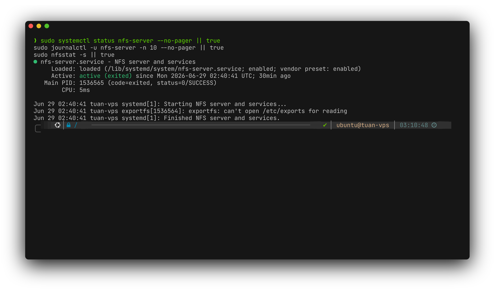
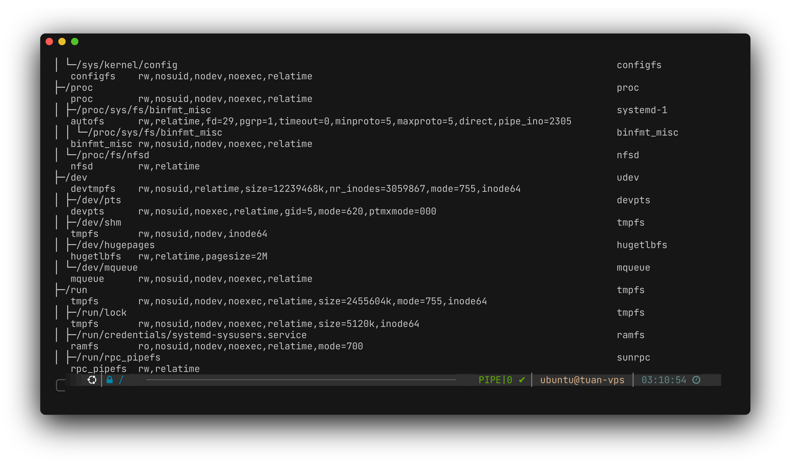
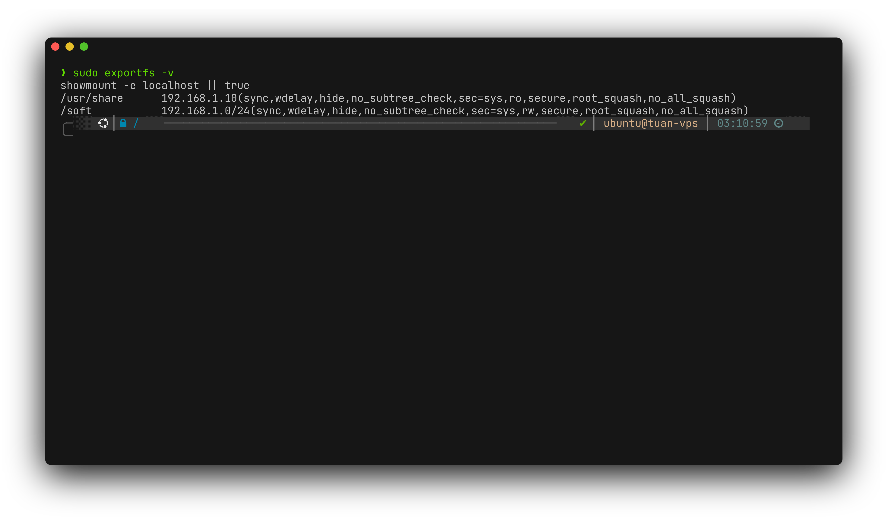
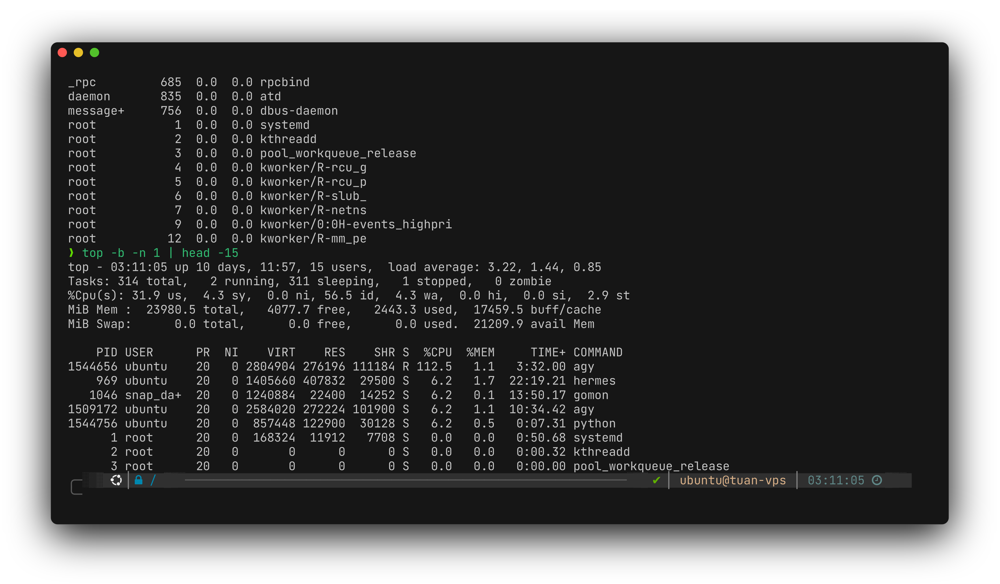

<div align="center">

# Bài tập Linux ngày 29/06

**Lời giải Đề của Tuấn**

| Họ và tên | Mã sinh viên |
| --- | --- |
| Hoàng Chiêu Nguyễn Tuấn | 2300536 |

</div>

## Cấu trúc thư mục

```text
.
├── README.md
├── scripts/
│   └── de_tuan.sh
└── tests/
    └── run_tests.sh
```

## Câu 1 (1 điểm)

Kiểm tra xem hệ thống có cài đặt **NFS** hay không. Nếu chưa được cài đặt thì dùng lệnh `rpm` để cài.




## Câu 2 (1 điểm)

Kiểm tra xem hệ thống có cài đặt **PORTMAP** hay không. Nếu chưa được cài đặt thì dùng lệnh `rpm` để cài.




## Câu 3 (1 điểm)

Export thư mục `/usr/share` chỉ cho phép máy có địa chỉ `192.168.xx.yy` mount vào mount point `/mnt/share` để sử dụng.




## Câu 4 (1 điểm)

Export thư mục `/soft` với quyền **RW** và chỉ cho phép các máy trong mạng `192.168.xx.0/24` mount vào mount point `/mnt/soft`.




## Câu 5 (1 điểm)

Dùng lệnh `rpcinfo` để kiểm tra dịch vụ **NFS** có đang hoạt động trong hệ thống hay không.




## Câu 6 (1 điểm)

Dùng lệnh `rpcinfo` để kiểm tra dịch vụ **PORTMAP** có đang hoạt động trong hệ thống hay không.




## Câu 7 (1 điểm)

Kiểm tra và xử lý các sự cố thống kê lỗi trên **NFS Server**.




## Câu 8 (1 điểm)

Liệt kê các filesystem của hệ thống đã được mount.




## Câu 9 (1 điểm)

Xem các export directory.




## Câu 10 (1 điểm)

Theo dõi và thống kê sử dụng tài nguyên hệ thống của User.



