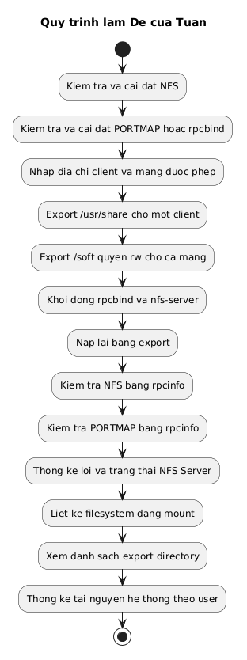
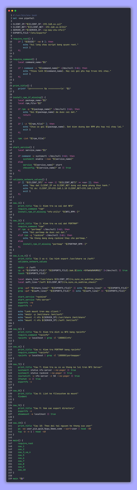

<div align="center">

# Bài thực hành Linux ngày 29/06

**Lời giải Đề của Tuấn**

| Họ và tên | Mã sinh viên |
| --- | --- |
| Hoàng Chiêu Nguyễn Tuấn | 2300536 |

</div>

## Cấu trúc thư mục

```text
.
├── README.md
├── assets/
│   ├── code-de-tuan.png
│   └── diagram-de-tuan.png
├── diagrams/
│   └── de_tuan_flow.puml
├── scripts/
│   └── de_tuan.sh
└── tests/
    └── run_tests.sh
```

## Sơ đồ xử lý



## Nội dung bài làm

Script `scripts/de_tuan.sh` thực hiện lần lượt 10 câu của đề:

| Câu | Chức năng |
| --- | --- |
| 1 | Kiểm tra gói `nfs-utils`, nếu thiếu thì cài bằng lệnh `rpm`. |
| 2 | Kiểm tra `portmap` hoặc `rpcbind`, nếu thiếu thì cài bằng lệnh `rpm`. |
| 3 | Export `/usr/share` chỉ cho phép một máy client được mount vào `/mnt/share`. |
| 4 | Export `/soft` với quyền đọc ghi cho mạng `192.168.xx.0/24` mount vào `/mnt/soft`. |
| 5 | Kiểm tra dịch vụ NFS bằng `rpcinfo`. |
| 6 | Kiểm tra dịch vụ PORTMAP bằng `rpcinfo`. |
| 7 | Kiểm tra trạng thái, nhật ký, thống kê lỗi và danh sách export của NFS Server. |
| 8 | Liệt kê các filesystem đang được mount. |
| 9 | Xem các export directory. |
| 10 | Theo dõi và thống kê tài nguyên hệ thống theo user. |

## Ảnh chụp mã nguồn



## Cách chạy

Thay địa chỉ IP và mạng theo phòng thực hành:

```bash
chmod +x scripts/de_tuan.sh
sudo CLIENT_IP=192.168.1.10 CLIENT_NET=192.168.1.0/24 SERVER_IP=192.168.1.1 bash scripts/de_tuan.sh
```

Nếu máy chưa có gói cài đặt, truyền đường dẫn tệp RPM:

```bash
sudo NFS_RPM=/duong/dan/nfs-utils.rpm PORTMAP_RPM=/duong/dan/portmap.rpm CLIENT_IP=192.168.1.10 CLIENT_NET=192.168.1.0/24 SERVER_IP=192.168.1.1 bash scripts/de_tuan.sh
```

## Kiểm thử

```bash
bash tests/run_tests.sh
```

Kiểm thử kiểm tra cú pháp Bash và sự tồn tại của các tệp chính trong bài.
